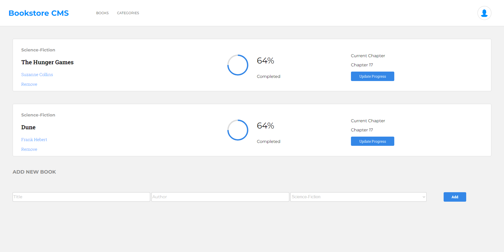

# Bookstore

> A simple website to store all your favorite books. Created with React.js

## Built With

- React

## Live Demo 🚀

[Live Demo Link](https://melaniesigrid.github.io/react-bookstore)

## Getting Started

To get a local copy up and running follow these simple example steps.

### Prerequisites
Install Node and npm using the `npm install` command on your computer.
### Setup
Clone this repository with `git clone https://github.com/melaniesigrid/reactBookstore.git` in your terminal.
Navigate to the project directory `cd react-bookstore`, and run `npm start`.

Or, visit my GitHub Pages deployment on [this link](https://melaniesigrid.github.io/react-bookstore)
## Author

👤 **Melanie Sigrid**

- GitHub: [@melaniesigrid](https://github.com/melaniesigrid)
- Twitter: [@SiriMoon11](https://twitter.com/SiriMoon11)
- LinkedIn: [LinkedIn](https://www.linkedin.com/in/melaniesigrid/)

## 🤝 Contributing

Contributions, issues, and feature requests are welcome!

Feel free to check the [issues page](../../issues/).

## Show your support

Give a ⭐️ if you like this project!

## Acknowledgments

- Hat tip to my code reviewers and partners at Microverse!

## 📝 License

This project is [MIT](./MIT.md) licensed.